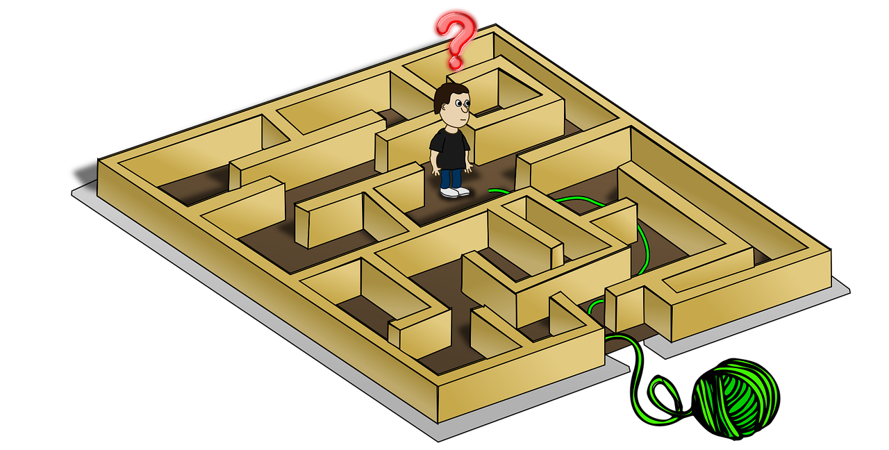
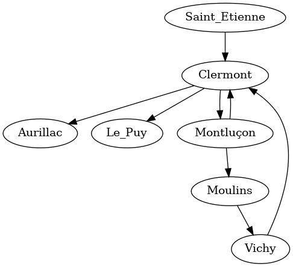

#+language: fr

#+title: Détective Pikaptcha, ou s'échapper d'un labyrinthe
#+author: Valentin PORTAIL
#+date: 15/02/2022

#+begin_center

Valentin PORTAIL - Prép'ISIMA 1 - 2021/2022

[[./images/logo_uca.png]] [[./images/logo_isima.png]]

[[https://perso.isima.fr/~vaportail/pikaptcha.html][Lien vers la page web]]

Image montant un personnage essayant de sortir d'un labyrinthe grâce à un "fil d'Ariane"

#+end_center

-----

#+toc: headlines

* Premier exercice : Cartographier le labyrinthe

** Enoncé du problème

On dispose d'une grille représentant un labyrinthe
et contenant deux types de valeurs :

- Un /0/ s'il y a un passage.
- Un /#/ s'il y a un mur, c'est-à-dire, une case infranchissable.

Chaque case de la grille possède au maximum 4 voisins
(en haut, en bas, à gauche ou à droite).
Les cases en diagonale ne sont donc pas adjacentes.

L'objectif est d'analyser la grille donnée et de la renvoyer
en remplaçant les /0/ par le nombre de passages adjacents,
c'est-à-dire, le nombre de cases /0/ autour de chaque case.
Les murs (/#/) ne seront pas remplacés.

Le programme prendra en argument :

- deux entiers /width/ et /height/ représentant respectivement
  la largeur et la hauteur de la grille
- un nombre /height/ de chaînes de caractères nommées /line/ et de longueur /width/
  contenant chacune une ligne de la grille avec les caractères /0/ et /#/.

La grille est entourée de murs infranchissables. Il faudra donc vérifier les
cases valides.

Le programme devra retourner les /height/ chaînes de caractères de /width/ caractères
qui contiendront chacune une ligne de la grille transformée.

** Solution proposée

Puisqu'on aura besoin de toutes les lignes pour pouvoir analyser les passages adjacents,
on les stocke dans un tableau à deux dimensions appelé /maze/
qui contient les cases du labyrinthe.

Chaque case sera identifiée par ses coordonnées /i/ et /j/
indiquant respectivement les coordonnées verticale et horizontale de la case.

On commence par demander à l'utilisateur la largeur et la hauteur du labyrinthe,
puis les lignes une à une.

#+name: pika1_demander_variables
#+begin_src C :results none

  int width; // Largeur du labyrinthe
      int height; // Hauteur du labyrinthe
      scanf("%d%d", &width, &height);

      int i; // L'index vertical d'une case
      int j; // L'index horizontal d'une case

      char maze[101][101]; // Un tableau à 2 dimensions qui contiendra les cases du labyrinthe

      for (i = 0; i < height; ++i) {
	  char line[101];
	  scanf("%s", line);

	  for (j = 0; j < width; ++j) {
	      maze[i][j] = line[j]; // On place chaque case dans le tableau
	  }
      }

#+end_src

On parcourt ensuite le labyrinthe
ligne par ligne et colonne par colonne.
Pour chaque case (/i/, /j/) qui n'est pas un mur,
on compte le nombre de passages autour de la case,
puis on remplace le /0/ par ce nombre dans le tableau /maze/.

On affiche enfin les résultats ligne par ligne.

#+name: pika1_compter_passages
#+begin_src C :results none

  for (i = 0; i < height; ++i) {
      for (j = 0; j < width; ++j) { // On parcourt chaque case du tableau
	  if (maze[i][j] != '#') { // Si la case n'est pas un mur
	      int passages = 0; // On va compter le nombre de passages adjacents
	    
	      if (i > 0 && maze[i-1][j] != '#') { // S'il y a un passage valide en haut
		  passages += 1;
	      }
	      if (i < height-1 && maze[i+1][j] != '#') { // S'il y a un passage valide en bas
		  passages += 1;
	      }
	      if (j > 0 && maze[i][j-1] != '#') { // S'il y a un passage valide à gauche
		  passages += 1;
	      }
	      if (j < width-1 && maze[i][j+1] != '#') { // S'il y a un passage valide à droite
		  passages += 1;
	      }
	    
	      maze[i][j] = '0' + passages; // Permet de convertir le nombre en un caractère ASCII
	  }
      }
      maze[i][width] = '\0'; // Permet d'indiquer que la ligne est bien finie (pour éviter les erreurs)
      printf("%s\n", maze[i]);
  }

#+end_src

Voici le plan du programme final :

#+name: pika1
#+begin_src C :flags -Wall -Wextra :tangle pika1.c :noweb no-export

  #include <stdio.h>

  int main() {
      <<pika1_demander_variables>>

      <<pika1_compter_passages>>
      return 0;
  }

#+end_src

** Tests

#+name: compile
#+BEGIN_SRC bash :var file_in="pika1.c" file_out ="pika1.out" :results none :exports none
  gcc -Wall -Wextra $file_in -o $file_out 
#+END_SRC

#+name: test_function
#+BEGIN_SRC python :results output :var exe="./pika1.out" test_in=test11.in test_out=test11.out :exports none
  import os
   
  f = open("test.in", "w")
  for u in test_in:
    f.write(u) 
  f.close()

  stream = os.popen(exe+" <test.in")
  output = stream.read()
  
  if output==test_out:
     print("Test réussi")
  else:
     print("Echec du test" )  
     print("obtenu :\t", output)
     print("désiré :\t", test_out)

#+END_SRC

#+call: compile("pika1.c", "pika1")

*** Test 1

Entrée :
#+name: test11.in
5 3
0000#
#0#00
00#0#

Sortie attendue :
#+name: test11.out
1322#
#2#31
12#1#

#+call: test_function("./pika1", test11.in, test11.out)

#+RESULTS:
: Test réussi

*** Test 2

Entrée :
#+name: test12.in
9 3
#00###000
000000000
000##0000

Sortie attendue :
#+name: test12.out
#22###232
244223443
232##2332

#+call: test_function("./pika1", test12.in, test12.out)

#+RESULTS:
: Test réussi

*** Test 3

Entrée :
#+name: test13.in
3 3
0#0
#0#
0#0

Sortie attendue :
#+name: test13.out
0#0
#0#
0#0

#+call: test_function("./pika1", test13.in, test13.out)

#+RESULTS:
: Test réussi

*** Test 4

Entrée :
#+name: test14.in
7 6
00000#0
0#0#000
00#00##
000#000
#0#00#0
0#00#00

Sortie attendue :
#+name: test14.out
22322#1
2#1#322
32#13##
241#322
#1#22#2
0#12#12

#+call: test_function("./pika1", test14.in, test14.out)

#+RESULTS:
: Test réussi

** Description d'une autre solution

Cette solution a été proposée sur Codingame par l'utilisateur "xerneas02" :

#+begin_src C

#include <stdlib.h>
#include <stdio.h>

char tab[101][101];

int main()
{
    int width, height, i, j, count;

    scanf("%d%d", &width, &height);
    
    for (i = 0; i < height; i++) scanf("%s", tab[i]);
    for (i = 0; i < height; i++) {
        for(j = 0; j < width; j++){
            if(tab[i][j] == '#')continue;
            if(i < height-1 && tab[i+1][j] != '#') tab[i][j]++;
            if(j < width-1 && tab[i][j+1] != '#') tab[i][j]++;
            if(i > 0 && tab[i-1][j] != '#') tab[i][j]++;
            if(j > 0 && tab[i][j-1] != '#') tab[i][j]++;
        }
    }
    for(i=0 ; i < height ; i++) printf("%s\n", tab[i]);
    return 0;
}

#+end_src

Cette solution a un principe similaire à la mienne. 
Elle compte le nombre de passages adjacents et le met dans un tableau.

Cependant, elle possède plusieurs avantages :
- Elle est plus compacte que la mienne (24 lignes contre 48 pour la mienne).
- Elle modifie directement les variables du tableau
  au lieu de passer par un entier supplémentaire que l'on reconvertit en
  caractère.

En revanche, on peut aussi noter plusieurs défauts :
- L'usage de la commande /continue/ qui est déconseillé.
- Certaines instructions sont sur la même ligne que les boucles qui leur sont associées
  et ne sont pas entourées d'accolades.
- Le tableau /tab/ est défini avant le /main/.

* Deuxième exercice : Explorer le labyrinthe

** Enoncé du problème

On dispose d'une grille similaire au premier exercice
représentant un labyrinthe
et contenant deux types de valeurs :

- Un /0/ s'il y a un passage.
- Un /#/ s'il y a un mur, c'est-à-dire, une case infranchissable.

La position et la direction de départ sont données par un caractère spécial :

- />/ : vers la droite
- /v/ : vers le bas
- /</ : vers la gauche
- /^/ : vers le haut

Un caractère permet d'indiquer le mur que l'on doit suivre :

- /R/ : Il faut suivre le mur de droite
- /L/ : Il faut suivre le mur de gauche

L'objectif est de parcourir le labyrinthe et de le renvoyer en remplaçant les
/0/ par le nombre de fois que l'on est passé par chaque case.
Les murs /#/ ne seront pas remplacés.

Le programme prendra en argument :

- deux entiers /width/ et /height/ représentant respectivement
  la largeur et la hauteur de la grille
- un nombre /height/ de chaînes de caractères nommées /line/ et de longueur /width/
  contenant chacune une ligne de la grille avec les caractères /0/ et /#/, ainsi
  qu'un unique caractère />/, /v/, /</ ou /^/ représentant la situation de départ.
- un caractère /side/ de valeur /R/ ou /L/ représentant le mur à suivre.

La grille est entourée de murs infranchissables. Il faudra donc vérifier les
cases valides.

Le programme devra retourner les /height/ chaînes de caractères de /width/ caractères
qui contiendront chacune une ligne de la grille transformée.

** Solution proposée

Dans ce programme, on notera la direction avec un entier compris entre 0 et 3 de
la manière suivante :

- 0 : droite
- 1 : bas
- 2 : gauche
- 3 : haut

Chaque case sera identifiée par ses coordonnées /i/ et /j/
indiquant respectivement les coordonnées verticale et horizontale de la case.

On notera la direction de départ, les coordonnées de la case de départ et de la
case suivante.

On commencera dans le programme principal
par demander à l'utilisateur la largeur et la hauteur du labyrinthe,
les lignes du labyrinthe une à une et le mur qu'il faut suivre.

#+name: pika2_demander_variables
#+begin_src C :results none

  int width; // Largeur du labyrinthe
      int height; // Hauteur du labyrinthe
      scanf("%d%d", &width, &height);

      char maze[101][101]; // Un tableau à 2 dimensions qui contiendra les cases du labyrinthe

      int i; // Coordonnée verticale d'une case
      int j; // Coordonnée horizontale d'une case

      int direction; // 0 : droite / 1 : bas / 2 : gauche / 3 : haut
      int direction_depart;

      int depart_i; // Coordonnée verticale de la case de départ
      int depart_j; // Coordonnée horizontale de la case de départ

      int next_i = -1; // Coordonnée verticale de la case suivante
      int next_j = -1; // Coordonnée horizontale de la case suivante
      // Initialisation à des valeurs impossibles pour le while

      for (i = 0; i < height; ++i) {
	  char line[256];
	  scanf("%s", line);

	  for (j = 0; j < width; ++j) {
	      maze[i][j] = line[j]; // On place chaque case dans le tableau
	  }
      }

      char side[2]; // Mur qu'il faut suivre
      scanf("%s", side);

#+end_src

On définit ensuite deux fonctions /nouveau_i/ et /nouveau_j/ qui prennent
en argument la coordonnée initiale /i/ ou /j/, la direction /direction/ et la
largeur /width/ pour /i/ ou la hauteur /height/ pour /j/.
Elles renvoient la nouvelle coordonnée en allant dans la direction indiquée.

#+name: pika2_fonctions
#+begin_src C :results none

  int nouveau_i (int i, int direction, int height) {
      int nv_i;

      if (((direction == 3) && (i == 0)) || ((direction == 1) && (i == height - 1))) {
	  nv_i = -1; // Coordonnée impossible
      } else {
	  switch (direction) {
	      case 1: // Si on va en bas
		  nv_i = i + 1;
		  break;
	      case 3: // Si on va en haut
		  nv_i = i - 1;
		  break;
	      default: // Sinon
		  nv_i = i;
	  }
      }

      return nv_i;
  }

  int nouveau_j (int j, int direction, int width) {
      int nv_j;
    
      if ((direction == 2 && j == 0) || (direction == 0 && j == width - 1)) {
	  nv_j = -1; // Coordonnée impossible
      } else {
	  switch (direction) {
	      case 0: // Si on va à droite
		  nv_j = j + 1;
		  break;
	      case 2: // Si on va à gauche
		  nv_j = j - 1;
		  break;
	      default: // Sinon
		  nv_j = j;
	  }
      }

      return nv_j;
  }

#+end_src

On commence par trouver la case de départ,
on récupère la direction initiale et on donne à la case la valeur /0/.

#+name: pika2_trouver_depart
#+begin_src C :results none

  int case_depart_trouvee = 0; // Booléen indiquant si la case de départ a été trouvée

      i = 0;
      while ((case_depart_trouvee == 0) && (i < height)) {

	  j = 0;
	  while (case_depart_trouvee == 0 && j < width) {

	      if (maze[i][j] != '0' && maze[i][j] != '#') {
		  case_depart_trouvee = 1;
		  depart_i = i;
		  depart_j = j;

		  switch (maze[i][j]) {
		      case '>': // Si on va à droite
			  direction = 0;
			  break;
		      case 'v': // Si on va en bas
			  direction = 1;
			  break;
		      case '<': // Si on va à gauche
			  direction = 2;
			  break;
		      case '^': // Si on va en haut
			  direction = 3;
			  break;
		      default: // Sinon (cas exceptionnel)
			  direction = -1;
		  }
	      }

	      ++j;
	  }

	  ++i;
      }

#+end_src

Une fois cette case trouvée, on parcourt le labyrinthe.
Plusieurs cas sont possibles :

- S'il n'y a pas de mur à gauche (ou à droite),
  on tourne à gauche (ou à droite) et on avance d'une case.
- S'il y a un mur à gauche (ou à droite)
  et s'il y a un mur en face,
  on tourne à droite (ou à gauche).
- Sinon, on avance d'une case sans tourner.

On ajoute 1 à chaque case sur laquelle on va.

#+name: pika2_parcourir_labyrinthe
#+begin_src C :results none

  i = depart_i;
  j = depart_j;
  direction_depart = direction;

  maze[i][j] = '0';

  while (maze[next_i][next_j] != maze[depart_i][depart_j] || (maze[depart_i][depart_j] == '0' && (maze[depart_i][depart_j] != '0' || direction != direction_depart))) {
      // On s'arrête quand :
      // - On est sur la case de départ et :
      //   - La case de départ n'est plus à 0 ou
      //   - La case de départ est toujours à 0 et la direction est celle de départ (on a fait un tour complet sans bouger)

      int devant_i = nouveau_i(i, direction, height);
      int devant_j = nouveau_j(j, direction, width); // Coordonnées de la case tout droit

      if (side[0] == 'L') { // Si on suit le mur de gauche

	  int gauche_i = nouveau_i(i, (direction+3) % 4, height);
	  int gauche_j = nouveau_j(j, (direction+3) % 4, width); // Coordonnées de la case à gauche

	  if ((gauche_i != -1 && gauche_j != -1) && maze[gauche_i][gauche_j] != '#') { // S'il n'y a pas de mur à gauche
	      next_i = gauche_i;
	      next_j = gauche_j; // On va à gauche
	      direction = (direction + 3) % 4; // On tourne à gauche
	      maze[next_i][next_j] += 1;
	  } else if ((devant_i == -1 || devant_j == -1) || maze[devant_i][devant_j] == '#') { // S'il y a un mur devant
	      next_i = i;
	      next_j = j; // On reste au même endroit
	      direction = (direction + 1) % 4; // On tourne à droite
	  } else { // Sinon
	      next_i = devant_i;
	      next_j = devant_j; // On va tout droit sans changer de direction
	      maze[next_i][next_j] += 1;
	  }
	
      } else if (side[0] == 'R') { // Si on suit le mur de droite
	
	  int droite_i = nouveau_i(i, (direction+1) % 4, height);
	  int droite_j = nouveau_j(j, (direction+1) % 4, width); // Coordonnées de la case à droite
	
	  if ((droite_i != -1 && droite_j != -1) && maze[droite_i][droite_j] != '#') { // S'il n'y a pas de mur à droite
	      next_i = droite_i;
	      next_j = droite_j; // On va à droite
	      direction = (direction + 1) % 4; // On tourne à droite
	      maze[next_i][next_j] += 1;
	  } else if (devant_i == -1 || devant_j == -1 || maze[devant_i][devant_j] == '#') { // S'il y a un mur devant
	      next_i = i;
	      next_j = j; // On reste au même endroit
	      direction = (direction + 3) % 4; // On tourne à gauche
	  } else {
	      next_i = devant_i;
	      next_j = devant_j; // On va tout droit sans changer de direction
	      maze[next_i][next_j] += 1;
	  }
	
      }
    
      i = next_i;
      j = next_j;

  }

#+end_src

Enfin, on affiche les lignes une par une :

#+name: pika2_afficher_lignes
#+begin_src C :results none

  for (i = 0; i < height; ++i) {
      maze[i][width] = '\0'; // Pour éviter les erreurs lors de la lecture de la ligne
      printf("%s\n", maze[i]);
  }

#+end_src

Voici le plan du programme final :

#+name: pika2
#+begin_src C :flags -Wall -Wextra :tangle pika2.c :noweb no-export

  #include <stdio.h>

  <<pika2_fonctions>>

  int main() {
      <<pika2_demander_variables>>

      <<pika2_trouver_depart>>

      <<pika2_parcourir_labyrinthe>>

      <<pika2_afficher_lignes>>

      return 0;
  }

#+end_src

** Tests

#+name: compile
#+BEGIN_SRC bash :var file_in="pika2.c" file_out ="pika2.out" :results none :exports none
  gcc -Wall -Wextra $file_in -o $file_out 
#+END_SRC

#+name: test_function
#+BEGIN_SRC python :results output :var exe="./pika2.out" test_in=test21.in test_out=test21.out :exports none
  import os
   
  f = open("test.in", "w")
  for u in test_in:
    f.write(u) 
  f.close()

  stream = os.popen(exe+" <test.in")
  output = stream.read()
  
  if output==test_out:
     print("Test réussi")
  else:
     print("Echec du test" )  
     print("obtenu :\t", output)
     print("désiré :\t", test_out)

#+END_SRC

#+call: compile("pika2.c", "pika2")

*** Test 1

Entrée :
#+name: test21.in
5 3
>000#
#0#00
00#0#
L

Sortie attendue :
#+name: test21.out
1322#
#2#31
12#1#

#+call: test_function("./pika2", test21.in, test21.out)

#+RESULTS:
: Test réussi

*** Test 2

Entrée :
#+name: test22.in
9 3
#00###000
0000<0000
000##0000
R

Sortie attendue :
#+name: test22.out
#11###000
112210000
111##0000

#+call: test_function("./pika2", test22.in, test22.out)

#+RESULTS:
: Test réussi

*** Test 3

Entrée :
#+name: test23.in
3 3
0#0
#>#
0#0
L

Sortie attendue :
#+name: test23.out
0#0
#0#
0#0

#+call: test_function("./pika2", test23.in, test23.out)

#+RESULTS:
: Test réussi

*** Test 4

Entrée :
#+name: test24.in
7 6
00000#0
0#0#000
00#0^##
000#000
#0#00#0
0#00#00
R

Sortie attendue :
#+name: test24.out
22322#1
2#1#322
21#01##
131#000
#1#00#0
0#00#00

#+call: test_function("./pika2", test24.in, test24.out)

#+RESULTS:
: Test réussi

** Description d'une autre solution

Cette solution a été proposée sur Codingame par l'utilisateur "Reynalde" :

#+begin_src C

#include <stdlib.h>
#include <stdio.h>
#include <string.h>
#include <stdbool.h>

/////////////////////////////////////
char dL[4]  = {'<', '^', '>', 'v'}; char dR[4]  = {'>', '^', '<', 'v'};
char dL1[4] = {'^', '>', 'v', '<'}; char dR1[4] = {'v', '>','^','<'};
char dL2[4] = {'>', 'v', '<', '^'}; char dR2[4] = {'<', 'v', '>', '^'};
char dL3[4] = {'v', '<', '^', '>'}; char dR3[4] = {'^', '<', 'v', '>'};
/////////////////////////////////////

struct position{
    int x,y;
    char dir;
    bool move;
};
typedef struct position pos;

 ////////////////// Deplacement ////////////////// 

pos moving(char grid[][256], pos p, char side, int h, int w, char directions[4]){
    int x = p.x; int y = p.y;
    int j=0; bool trouve=false;

 while(!trouve && j < 4){
         if ((directions[j] == '>' && y < w - 1 && grid[x][y+1] !='#') || !grid[x][y+1]==directions[j]){
            p.x=x; p.y=y+1; p.dir= '>'; p.move=true; trouve=true;
        }else if ((directions[j] == '^' && x > 0 && grid[x-1][y] != '#') || !grid[x-1][y]==directions[j]){
            p.x=x-1; p.y=y; p.dir= '^'; p.move=true; trouve=true; 
        }else if ((directions[j] == '<' && y > 0 && grid[x][y-1] != '#') || !grid[x][y-1]==directions[j]){
            p.x=x; p.y=y-1; p.dir= '<'; p.move=true; trouve=true; 
        }else if ((directions[j] == 'v' && x < h - 1  && grid[x+1][y] != '#') || !grid[x+1][y]==directions[j]){
            p.x=x+1; p.y=y; p.dir= 'v'; p.move=true; trouve=true;
        } j++;
    }   return p;
}
 ////////////////////////////////////////////////

int main(){
    int w,h,x,y; scanf("%d%d", &w, &h);
    char grid[256][256];
    pos p; bool end=false;

    for (int i = 0; i < h; i++) { char line[256]; scanf("%s", line);
        for(int j = 0; j < w; j++){
            grid[i][j]=line[j];
            line[j] != '0' && line[j] != '#' ? p.x = i, p.y = j, p.dir = line[j], p.move=false : 0;
        }
    }

    int pos=0; int index;
    int x_d = p.x; int y_d = p.y;
    char side[2]; scanf("%s", side); char s=side[0];

    while(end!=true){
        if (s=='L'){
            if (p.dir == '^') p=moving(grid,p,s,h,w,dL); 
            else if (p.dir == '>') p=moving(grid,p,s,h,w,dL1);
            else if (p.dir == 'v') p=moving(grid,p,s,h,w,dL2); 
            else if (p.dir == '<') p=moving(grid,p,s,h,w,dL3); 
        }else{
             if (p.dir == '^') p=moving(grid,p,s,h,w,dR);
             else if (p.dir == '>') p=moving(grid,p,s,h,w,dR1); 
             else if (p.dir == 'v') p=moving(grid,p,s,h,w,dR2); 
             else if (p.dir == '<') p=moving(grid,p,s,h,w,dR3);
       }
        x = p.x; y = p.y;
        if(grid[x][y] == '>' || grid[x][y] =='<' || grid[x][y] == '^' || grid[x][y] == 'v'){ 
            grid[x][y]='0';
            end=true;
        }else if(x == x_d && y == y_d){
            int pos=(int) grid[x][y]; pos++;
            grid[x][y]=(char) pos; end=true; 
        }
        if(p.move==true){ int pos= (int) grid[x][y]; pos++; grid[x][y]=(char) pos; }
    }

  ////////// Affichage  //////////
    for (int i = 0; i < h; i++) {
     for(int j = 0; j < w; j++) printf("%c", grid[i][j]);
      printf("\n");
    }
  ////////////////////////////////
return 0;
}

#+end_src

Dans cette solution, on crée une structure /pos/ qui contient les coordonnées
/x/ et /y/, la direction /dir/ et un booléen /move/ qui indique si le
déplacement a été effectué.

On peut trouver plusieurs avantages :
- Il n'y a plus qu'une seule fonction qui s'occupe de faire les déplacements.
- Le code est plus court et plus compact.

En revanche, il y a aussi de nombreux inconvénients :
- Le code est peu lisible et moins évident à comprendre.
- Il y a peu de commentaires qui pourraient faciliter la lecture du code.
- Certaines instructions sont sur la même ligne que les boucles qui leur sont associées
  et ne sont pas entourées d'accolades.

* Partie supplémentaire : Graphe réalisé avec GraphViz

La commande ci-dessous... :

#+begin_src dot :file "images/graphviz.png" :exports code

strict digraph {
    Clermont -> Aurillac
    Clermont -> Le_Puy
    Clermont -> Montluçon
    Montluçon -> Moulins
    Moulins -> Vichy
    Vichy -> Clermont
    Montluçon -> Clermont
    Saint_Etienne -> Clermont
}

#+end_src

...permet de réaliser le graphe suivant :

#+RESULTS:

#+options: toc:nil
#+options: ^:{}
#+html_head: <link rel="stylesheet" type="text/css" href="pikaptcha.css" />

