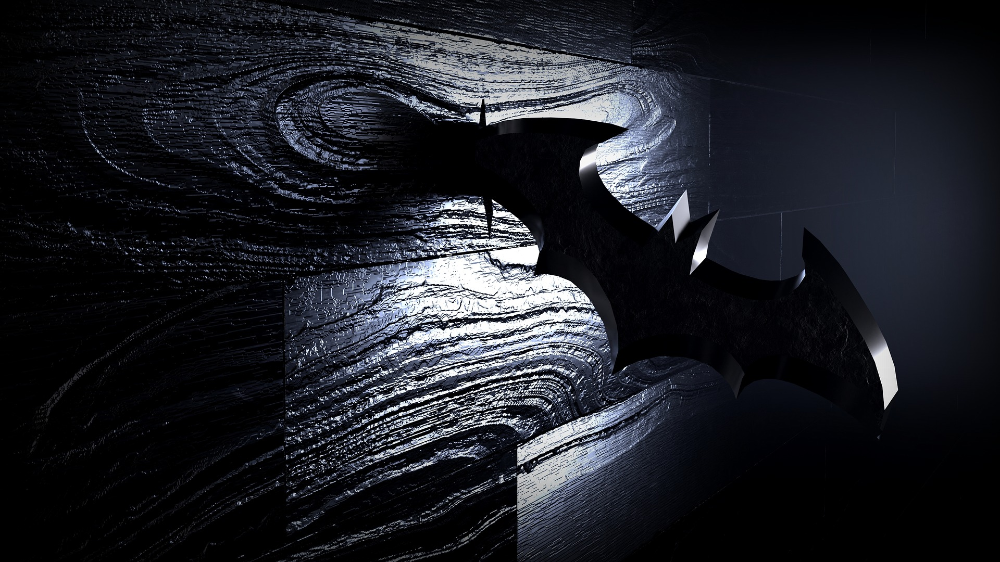

#+LANGUAGE: fr

#+TITLE: Shadows of the Knight : Une nouvelle réflexion sur un exercice de Codingame
#+AUTHOR: Valentin PORTAIL
#+DATE: 15/02/2022

#+begin_center

Valentin PORTAIL - Prép'ISIMA 1 - 2021/2022

[[./images/logo_uca.png]] [[./images/logo_isima.png]]

[[https://perso.isima.fr/~vaportail/shadow_knight.html][Lien vers la page Web]]

Image d'un objet en forme de chauve-souris planté dans un mur

#+end_center

-----

#+toc: headlines

* Introduction du problème
  
Cet exercice se déroule sur la façade d'un immeuble.
Chaque fenêtre est indiquée par ses coordonnées, celle en haut à gauche ayant pour coordonnées (0,0).

L'objectif est de déplacer le personnage, Batman, pour trouver les otages du bâtiment en sautant de fenêtre en fenêtre
pour trouver la pièce où ils se trouvent et désamorcer les bombes.
Cependant, il y a un nombre de sauts limité avant qu'elles n'explosent.

Avant chaque saut, la direction des bombes est indiquée :

- U (Up) : les bombes sont situées au dessus
- D (Down) : les bombes sont situées en dessous
- L (Left) : les bombes sont situées à gauche
- R (Right) : les bombes sont situées à droite
- UR (Up-Right) : les bombes sont situées au dessus et à droite
- UL (Up-Left) : les bombes sont situées au dessus et à gauche
- DR (Down-Right) : les bombes sont situées en dessous et à droite
- DL (Down-Left) : les bombes sont situées en dessous et à gauche

Lors de l'initialisation, le programme prend en argument deux entiers indiquant la largeur et la hauteur du bâtiment en nombre de fenêtres,
un entier représentant le nombre de sauts maximal et deux entiers indiquant la position de départ.

Lors d'un tour de jeu, le programme prend en argument la direction vers laquelle se trouve la bombe
et doit renvoyer deux entiers représentant la position de la fenêtre sur laquelle doit sauter Batman afin d'atteindre les bombes le plus tôt possible.

* Méthode de résolution

** Description synoptique

Pour résoudre cet exercice, nous allons utiliser la recherche dichotomique,
qui consiste à diviser la taille de la zone de recherche par 2 à chaque étape.

Il faut d'abord ignorer les fenêtres qui ne nous intéressent pas (par exemple, celles situées à gauche si les bombes sont à droite).
Ensuite, on cherche le centre de "la zone de recherche" pour s'y déplacer, puis recommencer avec la nouvelle position.

** Détail algorithmique

On commence par initialiser les variables /Xmin/ et /Xmax/, qui représentent la largeur du bâtiment,
ainsi que /Ymin/ et /Ymax/, qui représentent sa hauteur.
/Xmin/ et /Ymin/ sont initialisées à 0, 
tandis que les valeurs de /Xmax/ et de /Ymax/ sont demandées à l'utilisateur.

On demande ensuite à l'utilisateur le nombre maximal de tours avant la fin de la partie, noté /N/,
et les positions horizontale et verticale de départ, notées respectivement /X0/ et /Y0/.
Pendant tout le programme, elles devront être telles que $X0 \in [Xmin,Xmax]$ et $Y0 \in [Ymin,Ymax]$.

Comme /Xmax/ et /Ymax/ indiquent respectivement la largeur et la hauteur totales du bâtiment,
on doit leur retrancher 1 pour qu'elles indiquent la plus grande coordonnée possible.

#+begin_quote
*Remarque* : On entre ici dans une boucle infinie.
Les actions décrites ci-dessous seront donc répétées jusqu'à ce que le programme se termine.
#+end_quote

On demande à l'utilisateur la direction des bombes dans le format vu ci-dessus
que l'on va stocker dans une chaîne de caractères appelée /bomb_dir/.
Sa taille est de 3 caractères pour pouvoir stocker les deux caractères de la direction et le caractère de fin '\0'.

Le programme fait ensuite une série de tests afin de réduire la taille du rectangle de recherche.

Il commence d'abord par l'axe horizontal :

- S'il y a un 'R' dans la direction de la bombe (à droite), on ignore les cases à gauche.
  /X0 + 1/ devient donc le nouveau /Xmin/.
- S'il y a un 'L' dans la direction de la bombe (à gauche), on ignore les cases à droite.
  /X0 - 1/ devient donc le nouveau /Xmax/.

Il continue ensuite avec l'axe vertical :

- S'il y a un 'D' dans la direction de la bombe (en bas), on ignore les cases en haut.
  /Y0 + 1/ devient donc le nouveau /Ymin/.
- S'il y a un 'U' dans la direction de la bombe (en haut), on ignore les cases en bas.
  /Y0 - 1/ devient donc le nouveau /Ymax/.

#+begin_quote
*Remarque* : Le fait d'ignorer les cases sur la même colonne (pour l'axe horizontal) ou sur la même ligne (pour l'axe vertical)
que Batman permet d'optimiser le code.
En effet, s'il y a deux lettres dans la direction, alors la bombe ne peut pas se trouver directement à gauche, à droite,
en haut ou en bas
du personnage. Il n'y aurait alors qu'une lettre si c'était le cas. On peut donc éliminer ces cases.
#+end_quote

Le programme calcule ensuite le prochain emplacement où Batman doit sauter.
Cet emplacement est le centre du rectangle de recherche.

La nouvelle position horizontale /X0/ est donc égale à $\frac{Xmin + Xmax}{2}$ 
et la nouvelle position verticale /Y0/ est égale à $\frac{Ymin + Ymax}{2}$.
Puisqu'on fait une division entière (on ne souhaite pas, /a priori/, avoir des coordonnées décimales),
ces valeurs seront arrondies à l'entier inférieur près. 

Le programme affiche enfin la valeur de /X0/ et de /Y0/,
puis Codingame interprète ces données pour déplacer Batman à l'écran.

* Code commenté de la solution

Voici le programme proposé, écrit en langage C :

#+begin_src c

#include <stdio.h>

int main() {
    int Xmin = 0;
    int Xmax; // Largeur du bâtiment
    int Ymin = 0;
    int Ymax; // Hauteur du bâtiment
    scanf("%d%d", &Xmax, &Ymax);
    
    int N; // Nombre maximal de tours avant la fin de la partie
    scanf("%d", &N);

    int X0; // Position horizontale de départ
    int Y0; // Position verticale de départ
    scanf("%d%d", &X0, &Y0);

    Xmax -= 1; // Valeur maximale possible à l'horizontale
    Ymax -= 1; // Valeur maximale possible à la verticale

    // Boucle infinie 
    while (1) {
        char bomb_dir[3]; // Direction des bombes depuis la position (U, UR, R, DR, D, DL, L or UL)
        scanf("%s", bomb_dir);

        // Réduction de la zone de recherche

        if (bomb_dir[1] == 'R' || bomb_dir[0] == 'R') {
            Xmin = X0 + 1; // On ignore les cases à gauche
        } else if (bomb_dir[1] == 'L' || bomb_dir[0] == 'L') {
            Xmax = X0 - 1; // On ignore les cases à droite
        }

        if (bomb_dir[0] == 'D') {
            Ymin = Y0 + 1; // On ignore les cases en haut
        } else if (bomb_dir[0] == 'U') {
            Ymax = Y0 - 1; // On ignore les cases en bas
        }

        // Calcul du prochain emplacement où Batman doit sauter (centre du rectangle de recherche).
        X0 = (Xmin + Xmax) / 2;
        Y0 = (Ymin + Ymax) / 2;

        printf("%d %d\n", X0, Y0);
    }

    return 0;
}

#+end_src

* Analyse des résultats

Ce programme a réussi tous les tests proposés par Codingame.
Cependant, certains étaient validés de justesse.
Ainsi, il arrivait parfois que la bonne fenêtre soit trouvée lors du dernier essai avant l'explosion.

Globalement, le programme est plutôt rapide.

* Description d'une autre solution

La solution ci-dessous a été proposée sur Codingame par l'utilisateur "Alain-Delpuch" :

#+begin_src c

#include <stdio.h>

int main() {
    int W; // width of the building.
    int H; // height of the building.
    scanf("%d%d", &W, &H);
    
    int N; // maximum number of turns before game over.
    scanf("%d", &N);
    
    int X0;
    int Y0;
    scanf("%d%d", &X0, &Y0);

    int xmin = 0 ; int xmax = W ;
    int ymin = 0 ; int ymax = H ;
    
    // game loop
    while (N--) {
        char bombDir[4]; // the direction of the bombs from batman's current location (U, UR, R, DR, D, DL, L or UL)
        scanf("%s", bombDir);
        switch (bombDir[0]) {
            case 'U' : ymax = Y0 ; break ;
            case 'D' : ymin = Y0 ; break ;
            case 'R' : xmin = X0 ; break ;
            case 'L' : xmax = X0 ; break ;
        }
        switch (bombDir[1]) {
            case 'R' : xmin = X0 ; break ;
            case 'L' : xmax = X0 ; break ;
        }
        
        Y0 = (ymax + ymin)/2 ; 
        X0 = (xmin + xmax)/2 ; 
        
        printf("%d %d\n", X0, Y0);
    }
}

#+end_src

Cette solution m'a séduit car elle remplace la série de /if/ par deux /switch/,
ce qui rend le code plus lisible. La logique reste cependant similaire à mon programme.

En revanche, on peut regretter le fait que la recherche dichotomique ne soit pas plus optimisée :
on a ainsi, par exemple, /ymax = Y0/ au lieu de /ymax = Y0 - 1/.
De plus, la syntaxe du /switch/ n'est pas réglementaire :
plusieurs instructions sont sur une même ligne, ce qui n'est pas conseillé.

* Bilan des apprentissages

Pour conclure, lors de cet exercice, j'ai pu :

- renforcer mes connaissances sur les *chaînes de caractères*.
- revoir comment coder un algorithme de *recherche dichotomique* et bien l'optimiser.
- apercevoir des *structures particulières* en C (la boucle /while(1)/ pour faire une boucle infinie).
- *comparer* ma solution à celles *d'autres personnes*.

#+options: toc:nil
#+options: ^:{}
#+html_head: <link rel="stylesheet" type="text/css" href="shadow_knight.css" />

